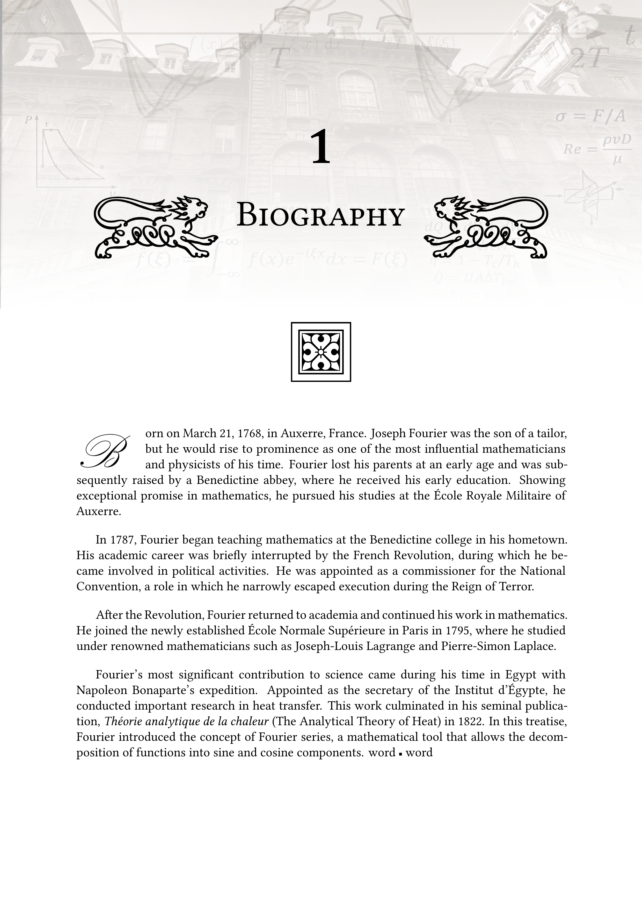

# 📖 LaTeX Biography Chapter Style

An elegant and classic LaTeX layout designed for chapter introductions, biographical sections, and historic academic overviews.

<div align="center">



</div>

## ✨ Features

* **Classic Typography:** Drop caps (initial letters) and decorative motifs.
* **Ornate Headers:** Clean chapter numbering with side ornaments.
* **XeLaTeX Ready:** Fully compatible with custom fonts and micro-typography.

## 🚀 Usage

Compile your document using **XeLaTeX**:

```bash
xelatex main.tex
